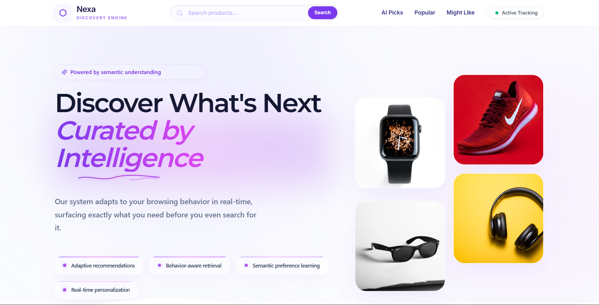

# Nexa — Adaptive Behavioral Personalization Engine

> A production-deployed, multi-user AI commerce platform that continuously evolves product recommendations by learning from real behavioral signals — not just what users search, but how long they look, what they click, and how deep they scroll.

<br/>


**Live:** [nexa-frontend.vercel.app](https://nexa-frontend.vercel.app) &nbsp;|&nbsp; **Backend:** Render &nbsp;|&nbsp; **Frontend:** Vercel

> "Click the image to system"

[](https://nexa-frontend.vercel.app)

---

## The Problem With Existing Recommendation Systems

Most e-commerce recommendation systems suffer from three fundamental issues:

**1. Passive tracking pollution** — They treat every search as equal interest. A user who searched "laptops" for 3 seconds while scrolling past it gets the same weight as someone who spent 148 seconds, clicked 6 products, and scrolled through every result. This pollutes the preference profile with noise.

**2. Static local data dependency** — Systems backed by static local databases can only respond to queries within their pre-scraped catalogue. A user searching for "Redmi Note 13 Pro Max" gets a 404. Product-specific intent is ignored entirely.

**3. Stale preferences** — Interest decays naturally over time. A user who searched winter jackets in December shouldn't be shown jackets in March. Systems with no temporal decay serve stale recommendations indefinitely.

**Nexa is built to solve all three.**

---

## How Nexa Solves These Problems

| Problem | Nexa's Solution |
|---|---|
| Passive tracking pollution | Behavioral signal engine with engagement suppression — weak sessions contribute near-zero weight |
| Static data dependency | Hybrid retrieval — indexed MongoDB for categories, live Playwright scraping via ngrok tunnel for product-specific queries |
| Stale preferences | Exponential temporal decay (λ=0.30) applied at session boundaries, auto-regenerating recommendations |
| Single user limitation | Full multi-user isolation — every behavioral collection scoped by `user_id` in MongoDB Atlas |
| Concurrent scraping conflicts | Asyncio semaphore + in-flight event tracking prevents duplicate scraping for identical concurrent queries |

---

## Production Architecture

```text
┌─────────────────────────────────────────────────────────────────────┐
│                     FRONTEND  (Vercel)                              │
│              React + TypeScript + Tailwind CSS                      │
│                                                                     │
│   Google OAuth Login → JWT stored in localStorage                   │
│   Every API call: Authorization: Bearer <JWT>                       │
│   WebSocket: /ws/search/{client_id} - live scraping terminal        │
└────────────────────────┬────────────────────────────────────────────┘
                         │ HTTPS
                         ▼
┌─────────────────────────────────────────────────────────────────────┐
│                   RENDER BACKEND  (FastAPI)                         │
│                                                                     │
│  POST /auth/google       → Verify Google token → issue JWT          │
│  GET  /auth/me           → Validate JWT → return user info          │
│  GET  /health            → Wake-up ping (prevents cold start)       │
│                                                                     │
│  GET  /api/ai-recommendations  → user_interest collection (MongoDB) │
│  GET  /products                → popular_products collection        │
│  GET  /api/you-might-like      → season + evergreen products        │
│  GET  /api/search              → Type 1: MongoDB / Type 2: ngrok    │
│  POST /api/track_user_behavior → full behavioral pipeline           │
│  GET  /api/category-insights   → category_similarity scores         │
│  GET  /api/user-signals        → user_behavior_log                  │
│                                                                     │
│  POST /api/admin/set-worker    → dynamically set ngrok tunnel URL   │
│  POST /api/internal/log        → receive scraper logs → WebSocket   │
│  WS   /ws/search/{client_id}   → live terminal stream to frontend   │
└────────┬────────────────────────────────────┬───────────────────────┘
         │                                    │
         ▼                                    ▼
┌─────────────────┐                 ┌──────────────────────┐
│  MongoDB Atlas  │                 │   Qdrant Cloud       │
│                 │                 │                      │
│  products       │                 │  Product vectors     │
│  users          │                 │  (384-dim cosine)    │
│  category_      │                 │  search_similar_     │
│  embeddings     │                 │  items()             │
│  display        │                 └──────────────────────┘
│  user_interest  │
│  popular_       │         ┌──────────────────────────────────┐
│  products       │         │   LOCAL MACHINE  (ngrok tunnel)  │
│  past_user_     │         │                                  │
│  embedding      │◄────────│  local_worker.py                 │
│  session_meta   │         │  POST /api/worker/scrape         │
│  user_behavior_ │         │                                  │
│  log            │         │  Playwright scrapes Flipkart     │
│  category_      │         │  → returns products to Render    │
│  similarity     │         │  → Render saves to MongoDB       │
│  scraped_       │         │  → Render streams logs to        │
│  products       │         │    frontend via WebSocket        │
│  query_category_│         └──────────────────────────────────┘
│  cache          │
└─────────────────┘
```


### Search Execution Flow
#### Nexa uses a two-path hybrid retrieval architecture depending on query type.

```text
User types query
                          │
                          ▼
           Is query in dict2 synonym map?
                          │
                ┌─────────┴─────────┐
               YES                 NO
                │                   │
                ▼                   ▼
             Type 1               Type 2
            Category         Product-specific
             query                query
                │                   │
                ▼                   ▼
             MongoDB         Is query already
             indexed       in scraped_products?
             lookup                 │
                │           ┌───────┴───────┐
                │          YES             NO
                │           │               │
                │           ▼               ▼
                │        Return      Gemini 2.5 Flash
                │        cached      detects category
                │       products    from CATEGORIES_STR
                │                   (pooled 10 API keys,
                │                   v1beta, cached in
                │                   query_category_cache)
                │                           │
                │                           ▼
                │                 Is ngrok worker online?
                │                           │
                │                   ┌───────┴───────┐
                │                  YES             NO
                │                   │               │
                │                   ▼               ▼
                │              Acquire          Return 503
                │              asyncio        WORKER_OFFLINE
                │             semaphore
                │                   │
                │                   ▼
                │              POST → ngrok → local_worker.py
                │              Playwright scrapes Flipkart
                │              → products returned to Render
                │              → saved to scraped_products
                │                (TTL: 24h auto-delete)
                │              → logs streamed to frontend
                │                via WebSocket terminal
                │                           │
                └──────────────┬────────────┘
                               │
                               ▼
                 Products returned to frontend
                               │
                               ▼
            User interacts (time + clicks + scroll)
                               │
                               ▼
                 POST /api/track_user_behavior
                               │
                               ▼
                   Behavioral pipeline executes
```


---

## Core Intelligence Modules

### 1. Behavioral Signal Engine

Three interaction signals captured per search session, each normalized independently:

| Signal | Weight | Normalization |
|---|---|---|
| Time Spent | 0.45 | `1 - e^(-t/120)` capped at 120s |
| Click Count | 0.45 | `1 - e^(-c/5)` capped at 5 clicks |
| Scroll Depth | 0.10 | `1 - e^(-s/200)` dampened |

**Weak interaction suppression** prevents passive sessions from polluting preferences:

```python
if time_spent < 10 and click_count == 0:
    engagement_score *= 0.15      # near-zero contribution

elif time_spent < 20 and click_count <= 1:
    engagement_score *= 0.40      # partial contribution
```

Output: a clean `[0, 1]` engagement weight that gates how strongly the current session influences the preference vector.

---

### 2. Adaptive Preference Memory (Embedding Accumulation)

User preference is stored as a continuously evolving 384-dimensional vector in MongoDB Atlas. Each session blends the new category embedding into historical preference:

```python
updated_embedding = past_embedding + weight × query_category_embedding
```

Key design decisions:
- **Category embeddings used instead of sentence transformers** — eliminates RAM dependency on Render's free tier (~250MB saved), uses pre-stored MongoDB category vectors
- **Magnitude preserved** — not unit-normalized after accumulation so temporal decay has a real value to reduce
- **Strong sessions dominate** — weight ∈ [0, 1] gates contribution proportionally to engagement

---

### 3. Temporal Memory Decay

Interest is not permanent. Nexa applies exponential decay at session boundaries:

decay_factor = max(0.05, e^(−λ × Δdays))

- Triggers only when a new calendar day begins
- Floor of `0.05` preserves memory essence — preferences never fully erase
- After decay, `user_interest` collection is immediately regenerated from the decayed embedding

```python
LAMBDA = 0.30   # 3-day gap retains ~41% of preference strength
                # 7-day gap retains ~12% of preference strength
```

---

### 4. Category Similarity Scoring

At every `track_user_behavior` call, the updated embedding is compared against all 41 pre-stored category embeddings via cosine similarity:

```python
similarity = dot(user_vec, category_vec) / (‖user_vec‖ × ‖category_vec‖)
```

Top-5 most similar categories drive the `popular_products` selection. All 41 scores are persisted to `category_similarity` (per user) and surfaced on the `/insights` page.

---

### 5. Multi-User Concurrent Scraping Architecture

When multiple users simultaneously submit Type 2 queries, two levels of concurrency control prevent resource conflicts:

**Level 1 — In-flight deduplication** (same query from multiple users):
```python
_in_flight_scrapes: Dict[str, asyncio.Event] = {}

if query in _in_flight_scrapes:
    # Second user waits for first user's scrape to complete
    await _in_flight_scrapes[query].wait()
    # Then reads from MongoDB cache — no duplicate scrape triggered
else:
    event = asyncio.Event()
    _in_flight_scrapes[query] = event
    # First user runs scrape, sets event on completion
```

**Level 2 — Global scraper semaphore** (different queries):
```python
_scraper_semaphore = asyncio.Semaphore(1)

async with _scraper_semaphore:
    # Only one Playwright session runs at a time
    # Other queries queue and receive WebSocket status updates
```

This prevents Playwright from launching multiple browser instances simultaneously on the local machine.

---

### 6. Gemini API Resilience

Category detection uses Gemini 2.5 Flash for product-specific queries. To prevent rate limit exhaustion:

- **10 Google Cloud projects** — each with independent quota (500 req/day each = 5000/day total)
- **Random key selection** per request from pooled keys
- **MongoDB query cache** — once "redmi note 10" maps to `mobiles`, it's cached permanently in `query_category_cache`. Gemini is never called again for the same query
- **v1beta endpoint** — free tier quota available (v1 stable requires billing)

```python
def get_gemini_client() -> genai.Client:
    api_key = random.choice(GEMINI_API_KEYS)
    return genai.Client(api_key=api_key, http_options={'api_version': 'v1beta'})
```

---

## MongoDB Atlas Collections

| Collection | Scope | Contents |
|---|---|---|
| `products` | Global | 820 products across 41 categories, 4 seasons |
| `category_embeddings` | Global | 41 category vectors (384-dim) + image URLs |
| `display` | Global | Default product set for new users |
| `users` | Global | Google OAuth user records |
| `scraped_products` | Global | Per-query scraped results, TTL 24h auto-delete |
| `query_category_cache` | Global | Gemini detection results, permanent cache |
| `user_interest` | Per user | Latest AI-generated recommendations |
| `popular_products` | Per user | Behavior-driven popular products |
| `past_user_embedding` | Per user | Evolving 384-dim preference vector |
| `category_similarity` | Per user | 41 category cosine scores |
| `session_meta` | Per user | Last session date for decay logic |
| `user_behavior_log` | Per user | Full interaction history |

All per-user collections are indexed on `user_id` for O(log n) lookup. Compound indexes: `(user_id, category)` on `category_similarity`, `(user_id, timestamp)` on `user_behavior_log`.

---

## Deployed System Architecture- Triggers only when a new calendar day begins
- Floor of `0.05` preserves memory essence — preferences never fully erase
- After decay, `user_interest` collection is immediately regenerated from the decayed embedding

```python
LAMBDA = 0.30   # 3-day gap retains ~41% of preference strength
                # 7-day gap retains ~12% of preference strength
```

---

### 4. Category Similarity Scoring

At every `track_user_behavior` call, the updated embedding is compared against all 41 pre-stored category embeddings via cosine similarity:

```python
similarity = dot(user_vec, category_vec) / (‖user_vec‖ × ‖category_vec‖)
```

Top-5 most similar categories drive the `popular_products` selection. All 41 scores are persisted to `category_similarity` (per user) and surfaced on the `/insights` page.

---

### 5. Multi-User Concurrent Scraping Architecture

When multiple users simultaneously submit Type 2 queries, two levels of concurrency control prevent resource conflicts:

**Level 1 — In-flight deduplication** (same query from multiple users):
```python
_in_flight_scrapes: Dict[str, asyncio.Event] = {}

if query in _in_flight_scrapes:
    # Second user waits for first user's scrape to complete
    await _in_flight_scrapes[query].wait()
    # Then reads from MongoDB cache — no duplicate scrape triggered
else:
    event = asyncio.Event()
    _in_flight_scrapes[query] = event
    # First user runs scrape, sets event on completion
```

**Level 2 — Global scraper semaphore** (different queries):
```python
_scraper_semaphore = asyncio.Semaphore(1)

async with _scraper_semaphore:
    # Only one Playwright session runs at a time
    # Other queries queue and receive WebSocket status updates
```

This prevents Playwright from launching multiple browser instances simultaneously on the local machine.

---

### 6. Gemini API Resilience

Category detection uses Gemini 2.5 Flash for product-specific queries. To prevent rate limit exhaustion:

- **6 Google Cloud projects** — each with independent quota (500 req/day each = 5000/day total)
- **Random key selection** per request from pooled keys
- **MongoDB query cache** — once "redmi note 10" maps to `mobiles`, it's cached permanently in `query_category_cache`. Gemini is never called again for the same query
- **v1beta endpoint** — free tier quota available (v1 stable requires billing)

```python
def get_gemini_client() -> genai.Client:
    api_key = random.choice(GEMINI_API_KEYS)
    return genai.Client(api_key=api_key, http_options={'api_version': 'v1beta'})
```

---

## MongoDB Atlas Collections

| Collection | Scope | Contents |
|---|---|---|
| `products` | Global | 820 products across 41 categories, 4 seasons |
| `category_embeddings` | Global | 41 category vectors (384-dim) + image URLs |
| `display` | Global | Default product set for new users |
| `users` | Global | Google OAuth user records |
| `scraped_products` | Global | Per-query scraped results, TTL 24h auto-delete |
| `query_category_cache` | Global | Gemini detection results, permanent cache |
| `user_interest` | Per user | Latest AI-generated recommendations |
| `popular_products` | Per user | Behavior-driven popular products |
| `past_user_embedding` | Per user | Evolving 384-dim preference vector |
| `category_similarity` | Per user | 41 category cosine scores |
| `session_meta` | Per user | Last session date for decay logic |
| `user_behavior_log` | Per user | Full interaction history |

All per-user collections are indexed on `user_id` for O(log n) lookup. Compound indexes: `(user_id, category)` on `category_similarity`, `(user_id, timestamp)` on `user_behavior_log`.

---

## Deployed System Architecture

## Project Structure

```text
backend + ai/
├── backend_mongodb_render.py      # FastAPI entry point (runs on Render)
├── local_worker.py                # Playwright worker (runs locally via ngrok)
├── auth.py                        # Google OAuth + JWT
├── db.py                          # Motor async MongoDB client + indexes
├── config.py                      # Environment config
├── services/
│   ├── search_service.py          # Hybrid retrieval + Gemini detection
│   ├── recommendation_service.py  # Qdrant search + embedding ops
│   ├── memory_service.py          # Session decay + profile regeneration
│   ├── mongo_store.py             # All MongoDB CRUD operations
│   ├── scrape_service.py          # Playwright scraper (local only)
│   └── ws_manager.py              # WebSocket connection manager
├── domain/
│   └── categories.py              # dict1 (season→categories), dict2 (synonyms)
└── models/
    └── schema.py                  # Pydantic models

frontend/                          # React + TypeScript + Tailwind (Vercel)
└── src/
    ├── context/AuthContext.tsx    # JWT auth state
    ├── lib/api.ts                 # Axios + JWT interceptor
    ├── pages/
    │   ├── Login.tsx              # Google OAuth login
    │   ├── Index.tsx              # Home — all recommendation sections
    │   └── Insights.tsx           # Category affinity visualization
    └── components/
        ├── search/SearchResults.tsx       # Infinite scroll + behavior tracking
        └── signals/ActiveSignalsPanel.tsx # Live behavioral data panel

```


---

## API Reference

| Method | Endpoint | Auth | Description |
|---|---|---|---|
| POST | `/auth/google` | Public | Exchange Google token for JWT |
| GET | `/auth/me` | JWT | Get current user info |
| GET | `/health` | Public | Backend wake-up ping |
| GET | `/api/ai-recommendations` | JWT | Personalized Qdrant results |
| GET | `/products` | JWT | Behavior-driven popular products |
| GET | `/api/you-might-like` | Public | Seasonal + evergreen blend |
| GET | `/api/search` | Public | Hybrid retrieval (Type 1/2) |
| POST | `/api/track_user_behavior` | JWT | Full behavioral pipeline |
| GET | `/api/category-insights` | JWT | User category affinity scores |
| GET | `/api/user-signals` | JWT | Raw interaction history |
| POST | `/api/admin/set-worker` | Public | Set active ngrok tunnel URL |
| POST | `/api/internal/log` | Public | Bridge scraper logs to WebSocket |
| WS | `/ws/search/{client_id}` | Public | Live scraping terminal stream |

---

## Recommendation Pipeline (Full Flow)

* **User authenticates via Google OAuth** → receives JWT
* **Frontend fires `/health` ping on load** → wakes Render from sleep
* **`GET /api/ai-recommendations`**
  * → `initialize_session_if_needed(user_id)`
  * → if new day: apply exponential decay to `past_user_embedding`
  * → regenerate `user_interest` via Qdrant search
  * → return `user_interest` collection (or `display` fallback for new users)
* **User searches query**
  * → Type 1: synonym match → MongoDB indexed product lookup
  * → Type 2: Gemini category detection (cached in `query_category_cache`)
  * → if scraped before: return `scraped_products`
  * → if new: acquire semaphore → POST to ngrok → Playwright scrapes
  * → products saved to MongoDB with 24h TTL
* **User exits search** → **`POST /api/track_user_behavior`**
  * → log entry appended to `user_behavior_log`
  * → query category embedding fetched from `category_embeddings`
  * → engagement weight computed from time/click/scroll signals
  * → `updated_embedding` = `past_embedding` + weight × `category_embedding`
  * → updated embedding saved to `past_user_embedding`
  * → cosine similarity computed against all 41 categories
  * → top-5 categories → `popular_products` updated
  * → Qdrant search with updated_embedding → `user_interest` updated
* **`GET /api/category-insights`**
  * → return `category_similarity` scores sorted descending
  * → displayed as taste profile visualization


---

## Tech Stack

| Layer | Technology |
|---|---|
| Backend | Python · FastAPI · Motor (async MongoDB) |
| Frontend | React · TypeScript · Tailwind CSS |
| Database | MongoDB Atlas (9 collections, compound indexes) |
| Vector Database | Qdrant Cloud (384-dim cosine similarity) |
| LLM | Google Gemini 2.5 Flash (pooled 10 keys, v1beta) |
| Auth | Google OAuth 2.0 · JWT (python-jose) |
| Scraping | Playwright async · local_worker.py · ngrok tunnel |
| Real-time | WebSockets (FastAPI native) |
| Deployment | Render (backend) · Vercel (frontend) |

---

## Engineering Highlights

- **Behavioral signal isolation** — each signal (time, click, scroll) normalized independently via exponential transforms before weighted combination; eliminates raw-scale dominance
- **Weak interaction suppression** — passive sessions contribute near-zero weight, preventing preference pollution
- **Category embedding substitution** — replaced sentence transformer model with pre-stored MongoDB category vectors, eliminating 250MB RAM dependency on Render free tier
- **Temporal memory decay** — exponential decay (λ=0.30) at session boundaries with 0.05 floor; auto-regenerates recommendations on day change
- **Two-level scraping concurrency control** — asyncio semaphore (one Playwright session at a time) + in-flight event deduplication (identical concurrent queries share one scrape)
- **Gemini API resilience** — 10-key pool across isolated Google Cloud projects + MongoDB query category cache; same query never hits Gemini twice
- **Per-user MongoDB isolation** — all behavioral collections scoped by user_id with compound indexes; O(log n) reads under concurrent load
- **24h TTL auto-expiry** — scraped_products collection self-cleans via MongoDB TTL index, no manual maintenance
- **WebSocket scraping terminal** — live Playwright logs bridged from local machine to React frontend via Render WebSocket relay
- **Cache-Control middleware** — forces mobile browsers to fetch fresh data on every load, preventing stale GET responses

---

## Configuration

Key constants in `config.py`:

```python
LAMBDA          = 0.30    # Decay rate — 3-day gap retains ~41% preference strength
EMBEDDING_SIZE  = 384     # Category embedding dimension
ALPHA           = 0.7     # Behavioral weighting constants
BETA            = 0.6
GAMMA           = 0.3
```

---

## Local Development Setup

**Prerequisites:** Python 3.12, Node.js 18+, MongoDB Atlas cluster, Qdrant Cloud collection, ngrok

```bash
# Backend
cd "backend + ai"
python -m venv backend_venv_latest
backend_venv_latest\Scripts\activate
pip install -r requirements.txt
playwright install chromium

# Environment
cp .env.example .env
# Fill: MONGODB_URI, MONGODB_DB, GOOGLE_CLIENT_ID, GOOGLE_CLIENT_SECRET,
#       JWT_SECRET, QDRANT_URL, QDRANT_API_KEY, COLLECTION_NAME,
#       GEMINI_API_KEY_1 ... GEMINI_API_KEY_10

# Seed MongoDB from local JSONs (one-time)
python migrate.py

# Run Render backend locally
uvicorn backend_mongodb_render:app --host 127.0.0.1 --port 8000

# Run local scraping worker (separate terminal)
uvicorn local_worker:app --host 0.0.0.0 --port 8001

# Expose scraping worker via ngrok (separate terminal)
ngrok http 8001
# Then update worker URL:
curl -X POST http://localhost:8000/api/admin/set-worker \
  -H "Content-Type: application/json" \
  -d '{"url": "https://xxxx.ngrok-free.app"}'
```

```bash
# Frontend
cd frontend
npm install
cp .env.example .env.local
# Fill: VITE_GOOGLE_CLIENT_ID, VITE_API_BASE_URL=http://localhost:8000
npm run dev
```

---

## Deployment

**Backend → Render**
- Runtime: Python
- Build: `pip install -r requirements.txt`
- Start: `uvicorn backend_mongodb_render:app --host 0.0.0.0 --port $PORT`
- Add all `.env` variables to Render environment settings

**Frontend → Vercel**
- Framework: Vite
- Add `VITE_GOOGLE_CLIENT_ID` and `VITE_API_BASE_URL` to Vercel environment variables
- Add Vercel domain to Google Cloud Console OAuth authorized origins and redirect URIs

**Scraping worker (local)**
```bash
uvicorn local_worker:app --host 0.0.0.0 --port 8001
ngrok http 8001
curl -X POST https://your-render-url.onrender.com/api/admin/set-worker \
  -H "Content-Type: application/json" \
  -d '{"url": "https://xxxx.ngrok-free.app"}'
```

---

*Built to demonstrate how behavioral embeddings, semantic retrieval, adaptive preference memory, temporal decay, and distributed scraping combine into a production commerce platform that genuinely evolves with each user over time.*